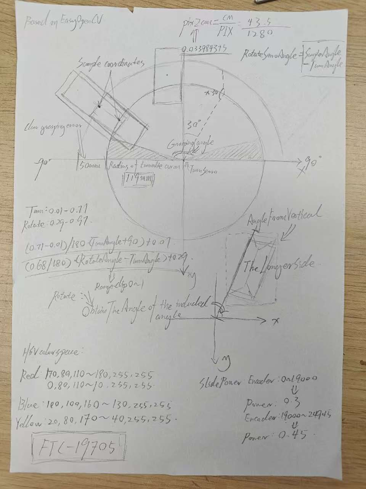
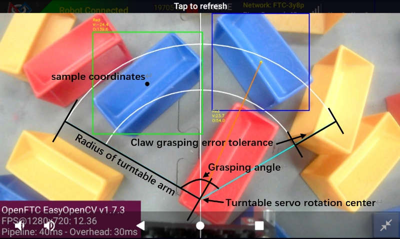

# FTC-2024-2025-VISION-for-19705 (来自27570队伍的技术支持)

## 项目简介

本项目是由来自 **FTC 27570 队伍 (BlueDarkUP)** 的程序员为 **FTC 19705 队伍** 在 FTC (FIRST Tech Challenge) 2024-2025 赛季开发的视觉识别程序。此代码专注于为19705队伍实现一套特定的机器人抓取策略，并基于对目标物体的识别与定位。

非常荣幸能够代表27570队伍为19705队伍提供技术支持，并感谢19705队伍提供的这次宝贵的跨队合作机会！

## 功能与原理

本视觉识别方案的核心原理是结合 **19705 队伍机器人结构** 特点，定义一个基于机器人当前姿态的 **“可抓取圆弧范围”**。

**工作流程：**

1.  **目标识别：** 视觉系统持续检测和识别赛场上的目标物体。
2.  **可抓取范围判断：**
    *   根据19705机器人自身结构（特别是抓取机构的位置和运动范围），程序会动态计算出一个圆弧形的有效抓取区域。
    *   这个圆弧代表了当滑轨（或其他伸出机构）缓慢向前伸出时，抓取器能够有效接触并抓取目标的位置。
3.  **抓取决策：**
    *   当19705机器人的滑轨处于缓慢前伸的过程中，视觉系统会实时监测是否有目标物体进入预设的“可抓取圆弧范围”。
    *   一旦检测到目标进入此范围，系统会立即触发抓取指令，执行抓取动作。

这种策略旨在利用19705机器人机构的运动特性，通过一个相对简单的几何判断，实现高效且精准的自动抓取。

**视觉原理示意图：**

下面展示了本视觉方案的原理草稿图以及在实际运行中的效果：

| 原理草稿 (On Paper)                                    | 实际运行效果 (On Driver Hub)                               |
| :-------------------------------------------------------: | :-----------------------------------------------------------: |
|  |  |

*左图：视觉抓取范围原理草稿。右图：视觉系统在19705机器人上实际运行时，根据机器人结构定义的“可抓取圆弧范围”示意。*

## 基于与致谢

本项目的视觉识别代码，其基础和灵感来源于我们 **FTC 27570 队伍** 在 "INTO THE DEEP" 赛季中开源的视觉识别代码。在此基础上，针对19705队伍的特定需求进行了适配和开发。

*   **27570 队伍 "INTO THE DEEP" 视觉代码参考链接：** [https://github.com/BlueDarkUP/FTC-27570-INTO-THE-DEEP](https://github.com/BlueDarkUP/FTC-27570-INTO-THE-DEEP)

**请注意：** 本仓库仅包含由我（代表27570队伍）为19705队伍编写和修改的部分视觉代码。

## 效果演示

以下视频展示了本视觉识别方案在19705机器人上测试时的表现，具有极高的识别精度和抓取成功率：

*   **视觉测试视频 1:** [https://www.youtube.com/watch?v=WAV9lTQ7WxU](https://www.youtube.com/watch?v=WAV9lTQ7WxU)
*   **视觉测试视频 2 (Shorts):** [https://www.youtube.com/shorts/D3_gpkGrB7c](https://www.youtube.com/shorts/D3_gpkGrB7c)

## 联系方式 (来自27570队伍的技术支持)

*   邮箱1: Blue_DarkMC@outlook.com
*   邮箱2: BlueDarkUP@Gmail.com
*   GitHub: [BlueDarkUP](https://github.com/BlueDarkUP) (如果这是你的GitHub用户名)

---

再次感谢 **19705 队伍** 给予 **27570 队伍** 的信任和这次宝贵的跨队合作机会！预祝 **19705 队伍** 在未来的 FTC 2025-2026 赛季中都能取得优异成绩！也祝愿我们27570队伍继续进步！
